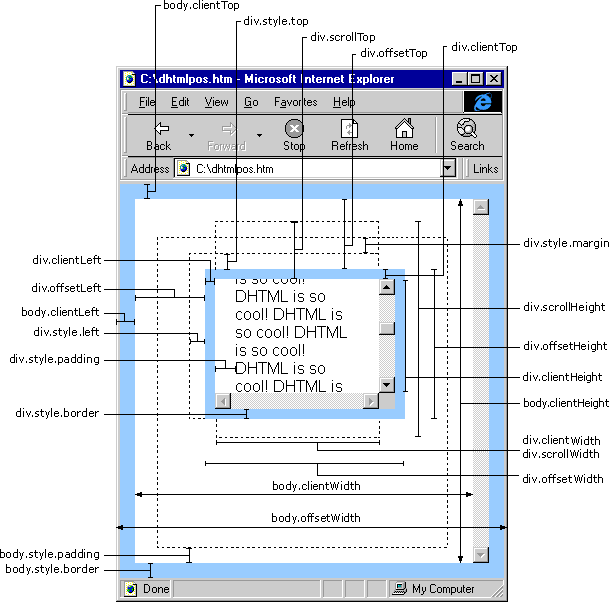

# scrollLeft、offsetLeft、clientLeft、clientHeight详解



## scrollHeight
获取对象的滚动高度，对象的实际高度；

## scrollLeft
设置或获取位于对象左边界和窗口中目前可见内容的最左端之间的距离

## scrollTop
设置或获取位于对象最顶端和窗口中可见内容的最顶端之间的距离

## scrollWidth
获取对象的滚动宽度

## offsetHeight
获取对象相对由父坐标 offsetParent 属性指定的父坐标的高度

## offsetLeft
获取当前对象到其上级层左边的距离.

## offsetTop
获取当前对象到其上级层顶部的距离.

## event.clientX
相对文档的水平座标

## event.clientY
相对文档的垂直座标

## event.offsetX
相对容器的水平坐标

## event.offsetY
相对容器的垂直坐标 

## document.documentElement.scrollTop
垂直方向滚动的值

## event.clientX+document.documentElement.scrollTop
相对文档的水平座标+垂直方向滚动的量

 

scrollLeft offsetLeft clientLeft clientHeight 2008-04-13 16:54

 

假设 obj 为某个 HTML 对象。

例如：
```
<div id="tool">
<input type="button" value="提交">
<input type="button" value="重置">
</div>
```
“提交”按钮的 offsetTop 指“提交”按钮距“tool”层上边框的距离，因为距其上边最近的是 “tool” 层的上边框。

“提交”按钮的 offsetLeft 指“提交”按钮距“tool”层左边框的距离，因为距其左边最近的是 “tool” 层的左边框。

以上属性在 FireFox 中也有效。

另外：我们这里所说的是指 HTML 控件的属性值，并不是 document.body，document.body 的值在不同浏览器中有不同解释（实际上大多数环境是由于对 document.body 解释不同造成的，并不是由于对 offset 解释不同造成的），点击这里查看不同点。

标题：offsetTop 与 style.top 的区别

预备知识：offsetTop、offsetLeft、offsetWidth、offsetHeight

我们知道 offsetTop 可以获得 HTML 元素距离上方或外层元素的位置，style.top 也是可以的，二者的区别是：

一、offsetTop 返回的是数字，而 style.top 返回的是字符串，除了数字外还带有单位：px 。

二、offsetTop 只读，而 style.top 可读写。

三、如果没有给 HTML 元素指定过 top 样式，则 style.top 返回的是空字符串。

offsetLeft 与 style.left、offsetWidth 与 style.width、offsetHeight 与 style.height 也是同样道理。


标题：clientHeight、offsetHeight和scrollHeight

我们这里说说四种浏览器对 document.body 的 clientHeight、offsetHeight 和 scrollHeight 的解释。

这四种浏览器分别为IE（Internet Explorer）、NS（Netscape）、Opera、FF（FireFox）。

clientHeight：是内容可视区域的高度，也就是说页面浏览器中可以看到内容的这个区域的高度，一般是最后一个工具条以下到状态栏以上的这个区域，与页面内容无关。

offsetHeight
IE、Opera 认为 offsetHeight = clientHeight + 滚动条 + 边框。
NS、FF 认为 offsetHeight 是网页内容实际高度，可以小于 clientHeight。

scrollHeight
IE、Opera 认为 scrollHeight 是网页内容实际高度，可以小于 clientHeight。
NS、FF 认为 scrollHeight 是网页内容高度，不过最小值是 clientHeight。

简单地说
clientHeight 就是透过浏览器看内容的这个区域高度。
NS、 FF 认为 offsetHeight 和 scrollHeight 都是网页内容高度，只不过当网页内容高度小于等于 clientHeight 时，scrollHeight 的值是 clientHeight，而 offsetHeight 可以小于 clientHeight。
IE、Opera 认为 offsetHeight 是可视区域 clientHeight 滚动条加边框。scrollHeight 则是网页内容实际高度。

同理
clientWidth、offsetWidth 和 scrollWidth 的解释与上面相同，只是把高度换成宽度即可。

但是
FF 在不同的 DOCTYPE 中对 clientHeight 的解释不同， xhtml 1 trasitional 中则不是如上解释的。其它浏览器则不存在此问题。
标题：scrollTop、scrollLeft、scrollWidth、scrollHeight

scrollTop 是“卷”起来的高度值，示例：

```
<div style="width:100px;height:100px;background-color:#FF0000;overflow:hidden;" id="p">

<div style="width:50px;height:300px;background-color:#0000FF;" id="t">如果为 p 设置了 scrollTop，这些内容可能不会完全显示。</div>
</div>
<script type="text/javascript">
var p = document.getElementById("p");
p.scrollTop = 10;
</script>
```

由于为外层元素 p 设置了 scrollTop，所以内层元素会向上卷。

scrollLeft 也是类似道理。

我们已经知道 offsetHeight 是自身元素的宽度。

而 scrollHeight 是内部元素的绝对宽度，包含内部元素的隐藏的部分。

上述中 p 的 scrollHeight 为 300，而 p 的 offsetHeight 为 100。

scrollWidth 也是类似道理。

IE 和 FireFox 全面支持，而 Netscape 和 Opera 不支持 scrollTop、scrollLeft（document.body 除外）。

标题：offsetTop、offsetLeft、offsetWidth、offsetHeight
------------------------------------------------------------------------------------------------------------

1. offsetTop :

当前对象到其上级层顶部的距离.
不能对其进行赋值.设置对象到页面顶部的距离请用style.top属性.

2. offsetLeft :

当前对象到其上级层左边的距离.
不能对其进行赋值.设置对象到页面左部的距离请用style.left属性.

3. offsetWidth :

当前对象的宽度.
与style.width属性的区别在于:如对象的宽度设定值为百分比宽度,则无论页面变大还是变小,style.width都返回此百分比,而offsetWidth则返回在不同页面中对象的宽度值而不是百分比值

4. offsetHeight :

与style.height属性的区别在于:如对象的宽度设定值为百分比高度,则无论页面变大还是变小,style.height都返回此百分比,而offsetHeight则返回在不同页面中对象的高度值而不是百分比值

5. offsetParent :

当前对象的上级层对象.
注意.如果对象是包括在一个DIV中时,此DIV不会被当做是此对象的上级层,(即对象的上级层会跳过DIV对象)上级层是Table时则不会有问题.
利用这个属性，可以得到当前对象在不同大小的页面中的绝对位置．
得到绝对位置脚本代码
```
function GetPosition(obj)
{
var left = 0;
var top   = 0;
while(obj != document.body)
{
    left = obj.offsetLeft;
     top = obj.offsetTop;
    obj = obj.offsetParent;
}

alert("Left Is : " + left + "\r\n" + "Top   Is : " + top);}
```

6. scrollLeft :

对象的最左边到对象在当前窗口显示的范围内的左边的距离．
即是在出现了横向滚动条的情况下，滚动条拉动的距离．

7. scrollTop

对象的最顶部到对象在当前窗口显示的范围内的顶边的距离．
即是在出现了纵向滚动条的情况下，滚动条拉动的距离．